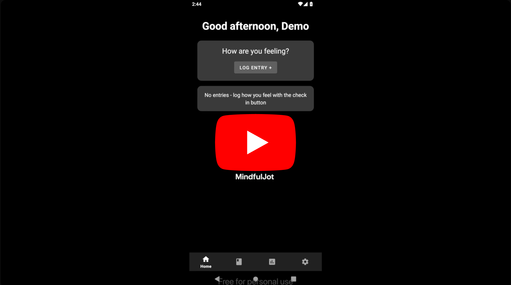
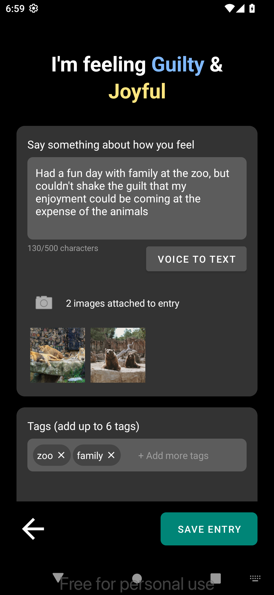

# MindfulJot

  

**MindfulJot** is a sleek, mobile-first Android app designed to support mental wellness through emotion tracking and journaling. Users can log daily entries with multiple emotions, view insights like mood streaks and emotional quadrant breakdowns, and reflect using a clean, intuitive UI.

## Demo Video

  

*(Recorded on Genymotion emulating a Google Pixel 5 running Android 13.0 / API 33)*

## Features

- Log daily entries with up to two emotions
- Add journal reflections, tags, and optional media
- Visualize mood insights:
  - Entry streaks
  - Emotion breakdowns by quadrant
  - Entry frequency over time
- Calendar view with emotion-dot indicators
- Firebase integration for syncing and test accounts
- Optional daily journaling reminders
- Swipe-to-delete with confirmation prompts
- Custom UI with ConstraintLayout and RecyclerViews

## Tech Stack

- **Language:** Java
- **Platform:** Android (min SDK 27, target SDK 35)
- **UI Components:** Material Design, ConstraintLayout, RecyclerView
- **Backend Services:**
  - Firebase Realtime Database (NoSQL)
  - Firebase Authentication
  - Firebase Storage (media upload)
  - Firebase Analytics
- **Key Libraries & Features:**
  - Picasso (image loading)
  - Android Speech-to-Text API (voice input)
  - [Applandeo Material Calendar View](https://github.com/Applandeo/Material-Calendar-View)

## Screen Previews

### Emotion Logging Flow
Capture your current mood with up to two selected emotions, add optional tags, and begin journaling with a clean, expressive UI.  

  

### Full Journal Entry View
Reflect on your emotions with full journal text, attached media, and tags.  

  

### Calendar Overview
Visualize your emotional patterns over time using a dot-based calendar view. 

  

### Mood Analytics Dashboard
Track streaks, quadrant-based emotion breakdowns, and frequency trends over time.  

  

## Getting Started

To run the app locally:

1. Clone this repository
2. Open it in Android Studio
3. Add your own Firebase `google-services.json` file under `app/`
4. Build and run on an emulator or Android device

## Stretch Goals

- Local storage with Room and offline syncing
- Tag filtering and search features
- Migrate from Picasso to Coil (picasso is formally deprecated)

## Project Origin & Note

This repository contains a standalone version of MindfulJot, an Android emotion-tracking journaling app originally developed as a university course project in collaboration with Elif Tirkes ([skippyskiddy](https://github.com/skippyskiddy)).

This version is maintained for portfolio presentation and continued experimentation with stretch goals (such as Room integration and Coil migration) without modifying the original academic codebase.

The original project repository can be viewed [here](https://github.com/skippyskiddy/MindfulJot-App).

All original commit history has been preserved to reflect the development process and individual contributions.

## Contributors

- **Joseph Mathew** ([jnmathew](https://github.com/jnmathew))  
  Lead on analytics view, calendar UI with Firebase filters, Room integration (currently a stretch goal), landscape layout support, test account setup, and various bug fixes.

- **Elif Tirkes** ([skippyskiddy](https://github.com/skippyskiddy))  
  Lead on app scaffolding, drawable assets, Firebase integration, emotion logging flow, onboarding, voice-to-text input, notifications, and overall design polish.

## License Information

This project uses the [Material Calendar View](https://github.com/Applandeo/Material-Calendar-View) library by [Applandeo](https://github.com/Applandeo).

**License:** [Apache License 2.0](http://www.apache.org/licenses/LICENSE-2.0)  
**Copyright:** © Applandeo
